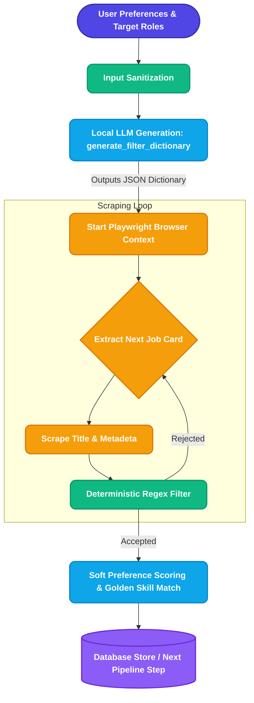
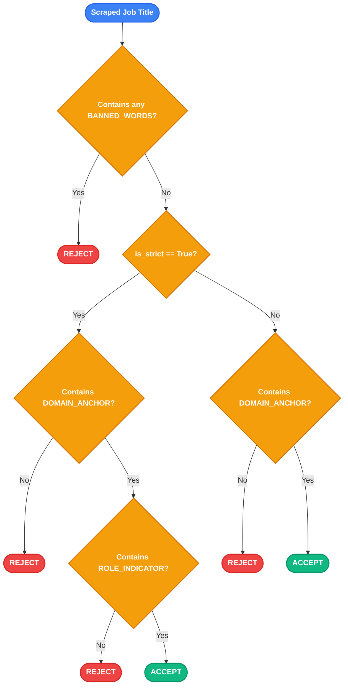

# Step 1: Intelligent Scraper & Dynamic Filter Engine

Welcome to the **Intelligent Scraper module**, the primary ingestion engine for the Kairos Automated Job Application Pipeline. 

This module serves a singular, critical purpose: retrieving broad, raw job listings based on user preferences and routing them through a high-precision filter to output a strictly relevant, highly curated bucket of job postings. This guarantees that downstream processes (like our ATS scoring and auto-application scripts) waste zero compute or API credits on irrelevant listings.

---

## Design Philosophy: Why This Architecture?

Our current architecture was born out of intense iteration and production failure analysis. Building a scraper that accurately categorizes jobs across domains required overcoming several mathematical and latency bottlenecks.

### The Vector Embedding Flaw (Semantic Blindspot)
Our initial pipeline attempted to map target roles and scraped job titles to vector embeddings using Cosine Similarity thresholds. This failed because mathematical mappings struggle to distinguish between functionally distinct but semantically adjacent roles. For instance, a "Data Scientist" and an "ML Engineer" share nearly identical vector clusters, leading to rampant false positives. Adjusting the threshold to fix this inadvertently created false negatives (rejecting valid synonyms).

### The Batch LLM Flaw (Latency & Hallucination)
We then shifted to real-time LLM validation, passing batches of 40 scraped job titles per page directly to a local LLM (Llama 3.1 8B) for binary classification. This caused two fatal production issues:
1. **Severe Latency & Timeouts:** Pinging the LLM on every DOM pagination caused massive execution delays, routinely crashing `httpx` and breaking Playwright contexts.
2. **The Buzzword Trap:** The LLM fell victim to marketing fluff. A "Digital Marketing" role mentioning "Generative AI Tools" or "ChatGPT" was hallucinated as an "AI Developer" role.

### The Ultimate Solution (Hybrid Pre-Computation Architecture)
We abandoned per-job classification and implemented **Dynamic LLM Dictionary Generation**. 
Before the browser even launches, the system queries the LLM exactly *once* to dynamically generate a JSON schema containing `domain_anchors`, `role_indicators`, and `banned_words`. During the scraping loop, we run lightning-fast, bounded Python Regular Expressions to match incoming job titles against this dictionary. 

This hybrid architecture achieves **AI-level semantic intelligence** with **sub-millisecond execution speeds** per job card, completely immune to timeouts and marketing fluff.

---

## Macro System Flow

The macro execution flow follows a synchronous, deterministic pipeline ensuring maximum reliability.

---

## Micro Step-by-Step Breakdown

The engine executes the following internal mechanics to guarantee zero false positives.

### 1. Input Sanitization
User-provided preference strings are notoriously dirty. The system preemptively strips trailing punctuation (e.g., `engineer.`, `developer,`) ensuring that stray characters do not leak into the LLM prompt or break the bounded regex matchers downstream.

### 2. Dynamic LLM Dictionary Generation
The pre-scrape rules engine constructs three vital arrays:
*   **Domain Anchors**: The core industry context (e.g., `["machine learning", "ai"]`).
*   **Role Indicators**: The functional seniority (e.g., `["engineer", "developer"]`).
*   **Banned Words**: The cross-domain rejection terms (e.g., `["sales", "hr"]`).

> [!IMPORTANT]
> **Mandatory Exact Match Injection:** To prevent LLM hallucinations or omissions, the exact words from the user's target roles are natively force-injected into the `domain_anchors` array. Common framework synonyms (`react` $\rightarrow$ `reactjs`) are automatically resolved and injected.

> [!TIP]
> **Atomicity Rule:** Multi-word titles (like "site reliability engineer") are kept intact. The word "site" is explicitly blacklisted from being extracted as a standalone anchor to prevent catastrophic domain drift (e.g., accidentally applying to civil engineering construction sites).

> [!NOTE]
> **Tech-Domain Negative Injection:** If the target is Software/IT, the prompt actively forces the LLM to pre-generate morphological bans for non-technical content (e.g., `["writer", "writing", "blog", "blogging"]`) and explicitly bans physical construction terms.

### 3. The Regex Filter Engine
Jobs are evaluated natively in Python using `re.search(rf'\b{re.escape(word)}\b')`. Bounded matching ensures that `"ai"` matches `"AI Engineer"` but does NOT match `"Mains"`, solving severe substring false positives.

### 4. Pagination & Ghost Cards
The scraper implements intelligent empty-state detection. If Internshala runs out of real listings and loads an invisible DOM template card (resulting in an `'Unknown Title'`), the loop immediately breaks. This prevents the scraper from mindlessly looping through 15 pages of empty ghost templates, saving vast amounts of compute.

---

## Filter Logic Decision Tree

The Regex Filter Engine uses the following rigid decision tree to evaluate scraped job titles.

